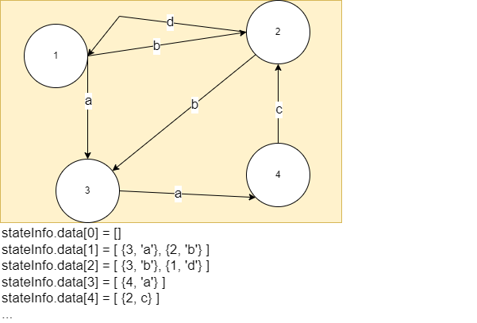

# Практикум 28.02.2023

## Задача първа
Нека разгледаме числата в интервала [0, ..., 49]. От всяко число можем да стигнем до друго число с някаква буква от азбуката ['a', ..., 'z']. Примерно, можем да имаме преход (26, 'a') -> 13.

* Да се реализира структура transition, която представлява преход. Структурата трябва да има две полета - **число в което отиваме** и **буквата която използваме за да стигнем до там**.

За всяко число дефинираме **най - много четири прехода**. Число заедно с информацията за неговите преходи наричаме състояние.
* Да се дефинира структура state, която пази преходите на едно състояние. Тя трабва да има **статичен масив от 4 прехода** и **променлива която пази броя на преходите** с начална стойност 0.

* Да се дефинира структура stateInfo, която пази информация за състоянията от 0 до 49. Тя трябва да съдържа **статичен масив от 50 елемента** от тип state. Нека наречем този масив data. За число i от интервала преходите на състояние i се пазят на позиция data[i].

Пример:



Да се напише функция
```
bool hasTransition(const stateInfo& arg, size_t from, char c);
```
която проверява дали имаме преход от from с буква *c*.

Да се напише функция
```
bool addTransition(stateInfo& arg, size_t from, char c, size_t to);
```
която добавя преход от състояние from с буква *c* към състояние to. Ако от състояние from имаме повече от 4 прехода функцията връща false.
Ако вече има преход с буква *c* състоянието се обновява и функцията връща true.

да се напише функция
```
int getTransition(const stateInfo& arg, size_t from, char c);
```
която връща къде отиваме от състояние from с буква *c*. Ако такъв преход няма функцията връща -1.

Да се напише функция
```
bool canRead(const stateInfo& arg, char* word, size_t from);
```
която проверява дали тръгвайки от from можем да прочетем word.

Да се напише функция
```
bool removeTransition(stateInfo& arg, size_t from, char c);
```
която премахва прехода от from с буква *c*.

## Задача втора
Да се създаде структура, която представлява наредена двойка от цели числа. Структурата има полета first и second. Да се реализират съответните функции:
* Функция, която прочита наредена двойка от стандартния вход
* Функция, която сравнява наредени двойки. Сравняването става по следния начин:

```
(a, b) > (c, d) <=> (a > c) || ( (a == c) && (b > d) )  
```

* Функция, която приема статичен масив от 100 наредени двойки и връща най-голямата наредена двойка.
* Функция, която приема динамичен масив от наредени двойки и ги сортира. 

## Задача трета
Да се създаде структура която описва студент. Структурата трябва да съдържа следните полета:
* Име на студента с максимална дължина 16 символа.
* Факултетен номер - винаги е петцифрено число.
* Курс - припомнете си изучавания на лекции тип enum class. Всеки студент е в първи, втори, трети или четвърти курс.
* Средна оценка за курса - винаги число с плаваща запетая между 3 и 6.

**Как ще разположите член-данните, за да може създадената от Вас структура да е оптимална по памет?**

Да се реализира функция
```cpp
void printStudent(const Student& toPrint)
```
която извежда на стандартния изход данните за студента.

Да се реализира функция
```cpp
bool initStudent(Student& toInit, char name[16], int facNumber, Course currentCourse, double grade);
```
която инициализира студент. Разбира се, данните, които са подадени, може да не са коректни. В такъв случай член-данните на студента не се променят и функцията връща false.

Да се напише функция:
```cpp
void printScholars(Student* students, size_t length, double average);
```
която извежда студентите, имащи среден успех над average на стандартния изход.
Бонус: Да се модифицира функцията така, че студентите да се извеждат в сортиран низходящ ред по успех на стандартния изход.