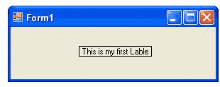
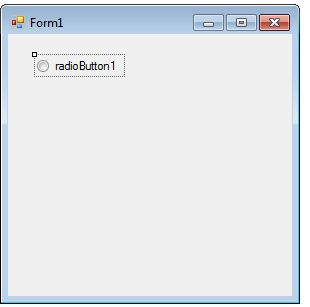
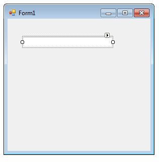
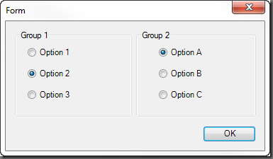

# Практикум 02.05.2023

## Задача първа
Да се реализира следната йерархия:
* Клас описващ компонента ComponentBase
  * Съдържащ координати по х и по у. 
  * чисто виртуален метод showDialog.
  * метод `move(float dx, float dy)`
* Клас Label наследяващ ComponentBase
  * Съдържа статичен масив от 16 символа.
  * Метода showDialog подканва потребителя да въведе координати и текст на етикета.

* Клас RadioButton наследяващ ComponentBase
  * Съдържа текст (отново с максимална дължина 16)
  * Има информация дали е избран или не (може да използвате `bool`)
  * Метода showDialog подканва потребителя да въведе име и да каже дали бутонът е включен или не
  * Метод `flip()`, който променя дали бутона е включен или не.
  * `bool isOn() const;` връща дали бутона е включен или не

* Клас TextBox наследяващ ComponentBase
  * Има текст с произволна дължина
  * Метода showDialog() подканва потребителя да въведе текст (от стандартния вход или като път към файл).
  * Може да използвате класът `MyString`

* Клас RadioGroupBox наследяващ ComponentBase
  * Съдържа `n` радиобутона и име (може да го представите като label).
  * Във всеки един момент само един радиобутон е включен а другите са изключени
  * Метода `showDialog()` подканва потребителя да избере кой от радиобутоните е включен и да въведе координатите.
  * Да се реализира матод `switch`, който променя включения радиобутон.

Създайте `void moveAll(ComponentBase** cb, float dx, float dy)` която премества всички компоненти в подадената колекция.
Създайте `void free(ComponentBase** cb, size_t size)` която освобождава паметта, използвана от вас.