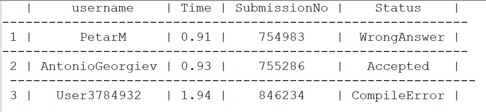

## Задача 1. 
Да се напише функция, която чете от конзолата 3 числа и записва във файл с име result.txt сумата и произведението им. Да се напише функция, която чете от файла result.txt двете получени стойности и отпечатва на конзолата разликата им.

Пример:

Вход (конзола):
```
4 5 6 
```
Файл result.txt:

```
15 120
```
Изход (конзола):

`-105
`

<h1>Задача 2</h1>

Напишете програма, която прочита текущия ви source code и отпечатва броя на:
- малките букви
- главните букви
- числа
- всички останали символи
 
<h1>Задача 3</h1>

Създайте структура, която описва болид от формула 1 със следните характеристики: <br>
- име на болида – до 64 символа
- година на производство
- вид на гумите – Soft, Medium, Hard, Intern, Wet
- коефициент на износване на гумите [0, 1]
- състояние, описващо дали в момента болидът е в бокса за ремонт
- максимален брой обиколки, които може да направи <br><br>

Нека предварително знаем, че производителят на гуми е фиксирал максимален брой обиколки, които могат да се направят със съотевтния тип в перфектни условия, игнорирайки коефициентът на износване:<br><br>
Soft -> 45 | Medium -> 50 | Hard -> 60 | Intern -> 40 | Wet -> 35 <br>

**Важно: моля, не си губете времето да пишете красиви и описателни коментари като пояснени при четенето на стойностите, а се фокусирайте върху функционалностите!** <br>
cout << “Enter bolid name”; cout << “Enter production year”; // ненужно !!! <br> 

Напишете фнукция за:
- Прочитане на данните за болида (направете отделна такава за прочитане на гумите)
- Изчислете максималният брой обиколки, които един боли може да направи по следната формула: **LowerBound({максимален брой обиколки по данни на производителя} * {коефициент на износване на гумите на съответния болид})**
- Сортиране на болидите по година на произвдство. (помислете с кой алгоритъм да сортирате) Работете върху подадения масив като аргумент.

Създайте масив от болиди и за всеки един прочетете данните за него <br>
// големината на масива е по ваше желание


**Работа с файлове** – напишете фунция, която <br>
- приема масив от болиди и записва информацията за всеки един от тях в текстов файл в csv формат, **сортирани** по година на производство
- прочита цялото съдържание на файла с болиди и ги отпечатва на стандартния изход


<h1>Задача 4</h1>

Напишете програма, която прочита името на текстов файл, прочита съдържанието му ред по ред и заменя всяка **първа буква** на дума със съответващата и главна и всеки **whitespace** с тире (заделете точно толкова памет, колкото е броя на символите на ред)<br> Всеки ред е разделен със запетая(тя не влиза към символите на редa). 
Новото съдържание да бъде записано в същия файл.

Пример: <br> <br>

**input.txt:** <br>
<pre>
bar foo fmi   oop,<br>
abcd   pqsl  fffd,
</pre>

**input.txt:** <br>
<pre>
Bar-Foo-Fmi---Oop,<br>
Abcd---Pqsl--Fffd,
</pre>
 
<h1>Задача 5</h1>

Създайте структура Submission с полета: <br>
- Username на потребител (без интервали) до 16 символа<br>
- Time (време, за което се изпълнява кода)<br>
- Номер на submission-а (трябва да се генерира последователно при създаване на нов submission)<br>
- Статус: Accepted, WrongAnswer, CompileError<br>

Симулирайте създаване на таблица за състезание по програмиане със следните функции и я запишете в текстов файл. Използвайте | за разделител<br>
- Добавяне на hеader ред с 4 колони (имена на колоните, съответстват на промнливите в структурата
- Добавяне на нов submission – прочетете данните за него. Измислитете проста валидация, и ако данните са невалидни – отпечатайте невалидния submission в друг файл в csv формат. Когато записвате валиден submission, добавате номер на реда
- Отпечатване на ред за разделител – само от тирета
- Прочитане на цялата таблица от файла в паметта на програмата ви.
- Отпечатайте на конзолата само тези submission-и, които са със статус Accepted, сортирани по време

Форматирайте таблицата да се подрявнява по **най-дългата дума в съответната колона** (ако броят на whitespace-овете за подравняване е нечетно число, отляво да бъдат с 1 повече)



