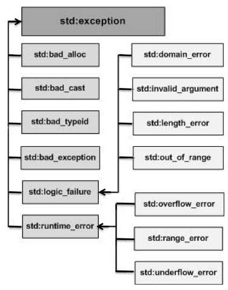

# Осми семинар по обектно ориентирано програмиране

## Ключовата дума static
Можем да използваме `static` в три различни контекста.

### static променливи във функции
```cpp
#include<iostream>

void f() {
    static int i = 0;   // Инициализира се веднъж
    i++;
    std::cout << i << std::endl;
}

int main() {
    f();
    f();
    f();
}
```
`Изход: 1, 2, 3`

Променливите декларирани във функция като статик се инициализират точно веднъж.

### static функции
```cpp
static void f() {
    // some work...
}
```
Статичните функции в някакъв смисъл са единствено предназначени само за .cpp файла в който са дефинирани. По подразбиране функциите са глобални, т.е. други .cpp файлове могат да ги виждат и да ги използват. Това може да доведе и до проблеми със свързването (linking), примерно когато се дублират имена. 

Този тип функции също се използва като оптимизация за linker-ът. Еквивалентно е на анонимния namespace изучаван на лекции.
### static в класове
```cpp
class Entity {
private:
    static int x; // Не принадлежи на никой обект. Споделя се между обекти. Единствена.
public:
    static void f() {
        // do work
    }
};

int Entity::x = 0;

int main() {
    Entity::f();
}
```
Статичните член-данни в класа са в някакъв смисъл единствени. Те не принадлежат на никой обект и отново се инициализират точно веднъж.
Статичните член-данни в класовете имат множество приложения като:
* Броене на инстанциите (създадени инстанции или живи инстанции)
* Реализация на Singleton design pattern в C++.
* Събиране на данни от всички обекти.

Можем и да имаме статични функции в класовете. Това са функции, които не са обвързани с обекта, НЕ могат да променят член-данните му и следователно не могат да бъдат const. За извикването им не ни трябва инстанция на класа.

## Изключения
Във всяка една програма могат да се появят логически грешки или грешки по време на изпълнение на програмата. един пример за такава ситуация е ```operator[]``` за класът ```String```, който написахме последния семинар.

```cpp
char String::operator[](size_t index) const
{
	assert(index <= size);
	return data[index];
}
```
В случая грешката, която може да се случи е очевидна - можем да подадем индекс, който е извън рамките на буфера. Как се справяме с подобни грешки? В случая е използван ```assert``` - ако грешката възникне програмата приключва. Но такива грешки могат да възникват по-често отколкото си мислим. Струва ли си при първата такава да прекратяваме програмата?

В повечето сцунарии предпочитания начин да се справим с грешки е да използваме изключения.

## Кога точно използваме изключения
В езика С (и не само) грешките се обработват или чрез връщане на стойност, която представлява код за грешка или чрез променяне на стойността на някоя глобална променлива, която извикващия функцията може да прочете. И в двата случая зависи от извикващия функцията да провери дали има грешка и да реагира на нея.

Ако не реагираме програмата ни може да продължи с некоректни данни (или да сегментира).

Изключенията се появяват със С++ и имат следните свойства:
* Изключението ни принуждава да се справим с проблема.
* Изключението отива до функцията която може да се справи с него. Междинните функции оставят изключението да продължи.
* Изключенията използват механизъм наречен stack unwinding, който унищожава всички обекти в скоупа по добре дефинирани правила.

Нека разгледаме как се хвърля изключение:

```cpp
char String::operator[](size_t index) const
{
	if(index >= size);
        throw std::out_of_range("Index out of range!");
    
	return data[index];
}
```

След като се хвърли изключението то ще започне да търси първата функция от стека, която може да се справи с него.

А как може функция да се справи с изключение? С изключения се справяме използвайки try-catch блокове:

```cpp
#include "String.h"
#include <iostream>

int main()
{
	String str = "Hello";

	try
	{
		std::cout << str[100];
	}
	catch (const std::out_of_range& e)
	{
		std::cout << e.what();
	}
}
```
Каква е идеята тук? Кодът в try се изпълнява нормално. Ако не хвърли изключение - супер. Ако хвърли се изпълнява кодa в catch. В случай, че имаме много изключения, които могат да се хвърлят можем да имаме няколко catch блока.

```cpp
try
{
    std::cout << str[100];
}
catch (const std::out_of_range& e)
{
    std::cout << e.what();
}
catch (const std::exception& e)
{
    std::cout << "STD exception" << e.what();
}
catch (...)
{
    std::cout << "Unknown exception";
}
```
Би било добре да си зададем въпроса какво е std::exception или std::out_of_range? Това са класове. Ролята на тези класове е да бъдат хвърляни като грешки и след това хващани. 

Това означава, че можем да хвърляме като грешки и наши класове? Можем. В някакъв смисъл има вероятност да се хвърли обект, който не предполагаме дори, че съществува. Синтаксисът `catch(...)` хваща всичко. Разбира се, ако се хвърли out_of_range той ще бъде хванат от първия catch блок.

Ако не се намери подходящ catch блок програмата терминира.

Нека разглидаме още един пример за да стане напълно ясно:
```cpp
#include <iostream>

void bar()
{
	throw std::exception("Oh no...");
}

void foo()
{
	bar();
}

int main()
{
	try
	{
		foo();
	}
	catch (const std::exception& e)
	{
		std::cout << e.what();
	}
}
```
В случая foo извиква bar която хвърля изключение. foo не знае как да се справи с него (няма try-catch блок) и го предава на main. Той от друга страна знае как да се справи с него и на стандартния изход се извежда очакваното съобщение.

## Какво можем какво не можем и какво трябва да хвърляме.
Мога да не използвам предоставените от стандартната библиотека обекти и да хвърлям мои.
```cpp
#include "String.h"
#include <iostream>

class MyException
{
	String str;
public:
	MyException(const String& str) : str(str) {}

	const String& what() const
	{
		return str;
	}
};

void bar()
{
	throw MyException("Oh no...");
}

void foo()
{
	bar();
}

int main()
{
	try
	{
		foo();
	}
	catch (const MyException& e)
	{
		std::cout << e.what();
	}
}
```
Обектите, които хвърлям, трябва да имат дефиниран копиращ конструктор (и move конструктор, но за това скоро). Ако изтриен копиращия конструктор по следния начин:
```cpp
MyException(const MyException&) = delete;
```
ще получим грешка.

Въпреки, че можем да хвърляме наши класове като грешки не е препоръчително. Все пак такива неща се правят (от по-големи библиотеки, които имат по-специфични изисквания). Препоръчано е да се използват грешките дефинирани в стандартния ```exception``` заглавен файл.



## Stack unwinding
В модела на С++ изключенията ```throw``` намира първия ```catch``` който може да се справи с хвърления тип. Когато този ```catch``` е достигнат всички променливи, които са в скоуп между хвърлящата и хващащата функция, биват унищожени. Този процес се нарича ```stack unwinding```.

В контекста на класове **деструкторите се извикват.**

```cpp
#include <iostream>

class Dummy
{
public:
	Dummy() { std::cout << "Default ctor" << std::endl; }
	~Dummy() { std::cout << "Dtor" << std::endl; }
};

void g()
{
	throw Dummy();
}

void f()
{
	Dummy d;
	g();
}

int main()
{
	Dummy d;
	try
	{
		f();
	}
	catch (...)
	{

	}
	std::cout << "End" << std::endl;
}
```

## Конструктори и деструктори в класове
Добра идея ли е да хвърляме изключения в конструктори? А в деструктори?

Езикът ни позволява и двете. За деструкторите можем със сигурност да кажем, че **изключения не се хвърлят!**. Когато се хвърли изключение приемаме, че е възможно деструктора на класа да се извика. Какво става обаче когато и той хвърли изключение? При две изключения програмата терминира. Не искаме това да се случи понеже можем да имаме загуба на информация от други класове, чиито деструктори не са се извикали.

Въпросът дали конструктор трябва да хвърля или не може да доведе до дискусия. Едно мнение по въпроса можем да прочетем [тук](https://isocpp.org/wiki/faq/exceptions#ctors-can-throw). Мнението, което автора на отговора изказва, е че да се хвърлят изключения в конструктора е **предпочитания начин да се справим с алтернативно невалидни обекти.** Това ще рече - ако обектът, след като е бил създаден, може да бъде в някое невалидно състояние е по-добре да хвърлим изключение отколкото да оставим така наречения от автора зомби обект да живее. 

Добре а какво правим сега:
```cpp
void f()
{
  X x;             // If X::X() throws, the memory for x itself will not leak
  Y* p = new Y();  // If Y::Y() throws, the memory for *p itself will not leak
}
```
Както е написано в коментарите ако X хвърли изключение няма отечка. Ако р хвърли паметта, нужна за указателя р не изтича. 

Да, но когато хвърлим изключение в конструктор, ако преди това сме заделили, деструктор не се вика. Това отечка ли е? Да, отечка е. В такъв случай се стремим да използваме член-данни, които са сигурни спрямо това как използват ресурсите си. Алтернатива на указателите, която сама се грижи за паметта си, са така наречените умни указатели. 

Все пак това е едно мнение по темата. На този етап можем съвсем спокойно да приемем конвенция, че изключения в конструктори не се хвърлят. Това все пак предполага други методи чрез които да се справим с невалидни обекти.

std::ofstream класът, приемайки невалиден път към файл, не хвърля изключение. Той вдига флаг, който можем да проверим чрез функцията is_open(). Това е още един начин за справяне с такива проблеми.

## Задача първа
Да се реализира клас `SelfCounting`, който поддържа следния интерфейс:
* getAlivaCount - връща броя на всички инстанции, които все още не са били унищожени.
* getCount - Връща броя на всички създадени инстанции.

## Задача трета
При използване на класа `String` можем да достигнем до следния случай:
```cpp
string str1 = "Hello";
string str2 = "Hello';
```
В този случай двата стринга пазят памет с една и съща стойност. В класическата имплементация на string, използвана от стандартната библиотека на C++ това поведение е по подразбиране. Всеки низ пази своята памет.

Съществува алтернативна имплементация, която ни ограничава, но е по ефикасна от към памет. Имплементацията забранява промяната на низовете, но низовете с еднаква стойност споделят паметта си.

Този начин на реализация на класа `String` използва идеята за `StringPool` - обект, който разпределя паметта между инстанциите на класа `string`. 

Да се реализира клас `ImmutableString`, който реализира описаната схема за работа с паметта. За тази цел ще се наложи да реализираме клас `StringPool`, който да пази паметта.

Класът `StringPool` съдържа следния публичен интерфейс:
* getString(const char*) - връща указател към низа ако съществува. в противен случай го създава и връща указател към него
* removeString(const char*) - сигнализира, че един от потребителите на низа е спрял да го използва. Ако низа няма никакви потребители той се изтрива.

Класът няма горна граница за низовете които може да поддържа. 