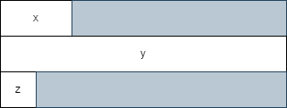
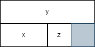

# Семинар 01
*Резюме: Преговор на динамична памет и указатели. Въвеждаме идеята за структура. Разглеждаме представянето на структури в паметта, работата с тях и създаването на месиви от структури.*

## Технически преговор
Разбирането на това как С++ работи с паметта е умение, по което е работено в уводния курс по програмиране и което ще е нужно за гладкото протичане на текущия курс. 

Когато работим с някаква информация имаме нужда да я съхраняваме някъде - тук на помощ идва паметта. Всяка променлива заема някаква памет в зависимост от типа си. Разбира се много често информацията, която използваме не се побира в една променлива. Тук на помощ идват статичните масиви:

```cpp
int main() {
    int arr[50]; // Статичен масив от 50 елемента
}
```

Паметта, използвана от статичните масиви, се заделя по време на компилация в системния стек. Това значи, че числото, което подадем в *[]* трябва да е константа. 

```cpp
#include<iostream>

int main() {
    int size = 0;
    std::cin >> size;
    int arr[size];      // Грешка!!!
}
```

Какво правим обаче, когато искаме да имаме масив с големина, която не знаем предварително? Да, винаги можем да заделим много голям статичен масив, но това е преразход на памет. Тук на помощ идва динамичната памет. Динамичната памет се заделя с ключовата дума new и се намира в heap паметта.

```cpp
#include<iostream>

int main() {
    int size = 0;
    std::cin >> size;

    int* arr = new int[size];
    // Работим с масива както обикновено...
    delete[] arr;
}
```

Припомняме си, че указателя е просто **променлива, която съдържа адрес на друга променлива.** В случая arr e указател към адреса на първата клетка от size * sizeof(int) байта последователна памет.

```
Важно: Паметта трябва да се трие! Ако памет, заделена с new, не се освободи с delete, това се счита за грешка!
```

```
Важно: Добре е да знаете кога да използвате статична и кога динамична памет. Ако знаете колко обекта ще имате често статичния масив ще Ви свърши работа. Когато не знаете колко обекта ще имате (примерно са въведени от потребител, подават се като вход и т.н.) динамичната памет е правилното решение.
```

Допълнително: Какво бяха pointer arithmetics?

## Структури
В уводния курс по програмиране бяха разгледани примитивни типове. Такива типове бяха int, char и тн. Езикът С++ ни дава възможността да дефинираме и свои типове от данни.

Структурите в C++ са съставен тип данни. Използват се за групиране на елементи. Елементите могат да бъдат от различен тип и с различна дължина. Последното е точно това, което различава структурите от масивите. В масивите съхраняваме данни от еднакъв тип.

```cpp
struct Point {
    double x;
    double y;
};

struct Person {
    char firstName[16];
    char lastName[16];
    unsigned short age;
};
```

## Работа със структури
Вече видяхме как можем да създадем структура. Също така видяхме, че нищо не ни пречи в структурата да имаме масив. Нищо не ни пречи и в структурата да имаме друга структура, но това малко по-късно. 

```cpp
int main() {
    Point start;    // Създаваме инстанция на Point
    start.x = 0.1;  // Променливите в start могат да бъдат достъпвани/променяни спокойно.
    start.y = 0.2;
}
```

Така създадена паметта за структурата Point се съдържа в системния стек. Нищо не ни пречи да съхраняваме структурите си в heap паметта:

```cpp
#include<iostream>
#include<cstring>

int main() {
    Person* p1 = new Person;

    strcpy(p->firstName, "Yavor");
    strcpy(p->lastName, "Aleksandrov");
    p->age = 12;

    std::cout << p->firstName << " " << p->lastName;
}
```

Също така нищо не ни пречи да подаваме структури като аргументи на функции:

```cpp
// Ако няма да променяме инстанцията я подаваме като котстантна референция.
void printPerson(const Person& p) {
    std::cout << p.firstName << " " << p.lastName << " " << p.age << std::endl;
}
```

Можем да променяме структурата:
```cpp
// Функция която променя полето age на инстанцияна на newAge.
void setAge(Person& p, unsigned short newAge) {
    p.age = newAge;
}
```

Можем и да я подаваме по копие:
```cpp
void doSomething(Person p) {
    // Работим с копие на подадената инстанция.
    p.age = 10;
}

int main() {
    Person p;
    p.age = 12;
    doSomething(p);
    std::cout << p.age << std::endl; // какво ще изведе този код?
}
```

```
Важно: Уверете се, че разбирате какво означава да подаваме променлива по копие или по референция.
```

Можем да връщаме примитивни типове от функция - защо да не можем да връщаме и съставни:

```cpp
#include<cstring>

Person createPerson(char fName[16], char lName[16], unsigned short age) {
    Person toReturn;

    strcpy(toReturn.firstName, fName);
    strcpy(toReturn.lastName, lName);

    toReturn.age = age;

    return toReturn;
}

int main() {
    Person p1 = createPerson("Nikola", "Svetoslavov", 22);
}
```
Можем да правим и масиви от структури:
```cpp
int main() {
    Point arr[32];

    for(int i = 0; i < 32; i++) {
        arr[i].x = rand();
        arr[i].y = rand();
    }

    Point* dynamicArr = new Point[2];
    dynamicArr[0].x = dynamicArr[0].y = 0;

    dynamicArr[1].x = dynamicArr[1].y = 1;

    delete[] dynamicArr;
}
```

## Представяне на структури в паметта
Структурите заемат памет. Да разгледаме следния пример:
```cpp
struct Example {
    short x;
    int y;
    char z;
};
```
Какъв е размерът на тази структура? Ако не сме се сблъсквали с този проблем отговорът може би би бил 7. Все пак имаме 2 байта от *x* още 4 байта от *y* и още 1 байт от *z*. Правилният отговор тук обаче е 12. Но защо?

Това се случва заради **подравняването** или така наречения **padding**. Нещата интуитивно изглеждат така:


като сивите байтове са така наречените **padding bytes**. Накратко, имаме нужда от тях за да може процесора да чете паметта по - бързо. На цената на малко допълнително памет четенето ѝ става по - бързо.

Примерно, ако имахме следната структура:

```cpp
struct Example {
    short x;
    double y;
    char z;
};
```

Нейния размер би бил 24. **Интуитивно** нещата биха изглеждали по следния начин:



Разбира се, това представяне е **интуитивно**, понеже паметта е **последователна**.

Подравняването се извършва автоматично от компилатора. Възможно е обаче да спестим памет ако разположим променливите си по подходящ начин. Нека пренапишем структурата така:

```cpp
struct Example {
    int y;
    short x;
    char z;
};
```
Сега вече размерът ѝ е 8. Това може да проверите като използвате следния код:
```cpp
int main() {
    std::cout << sizeof(Example); // Връща размера на структурата.
}
```
Защо сега използваме по-малко памет? Поглеждайки отново представянето имаме:

 

Тоест, чрез просто пренареждане на данните спестихме 4 байта памет.

## Задача 1 (от първа тема - устен изпит)
Въвежда се цяло число N, последвано от N тригъгълника в равнината, всеки от които се определя от 3 точки (6 координати). Отпечатайте лицата им в сортиран вид.

---
* Още задачи за упражнение можете да намерите в папките за практикум.

* Част от материалите са взаимствани от [тук](https://github.com/MariaGrozdeva/Object-oriented_programming_FMI/tree/main/Sem_01).