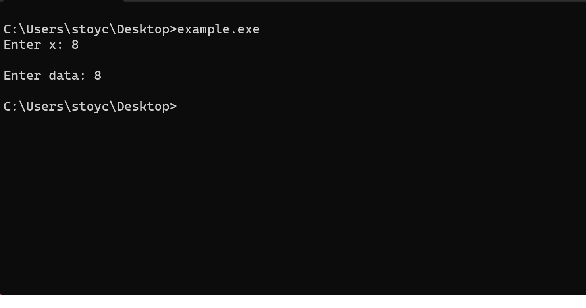

# Семинар 02
*Резюме: Въвеждаме понятието поток. Разглеждаме различни похвати за работа с потоци и файлове.*

## Потоци
Поток в С++ е последователност от информация влизаща или излизаща от нашата програма. Пример за обекти използващи потоци са **std::cin** и **std::cout**. Да разгледаме следния пример:

```cpp
#include<iostream>

int main() {
    int x = 0; char data[8];
    
    std::cout << "Enter x: ";
    std::cin >> x;
    // std::cin.ignore();
    std::cout << std::endl << "Enter data: ";
    std::cin.getline(data, 8, '\n');

    std::cout << x << std::endl << data;
}
```
Нека да стартираме тази програма и да проверим какво точно ще се случи:

Виждаме, че нашата програма не работи точно по начинът по който очаквахме, но защо? Това е една особеност на потоците в С++. Цялата информация (в случая последователност от символи) се движи точно като поток от нашата конзола към нашата програма.

Как изглежда потокът в случая:
```
8 \n
```
Този нов ред се появява понеже сме натиснали бутонът Enter. Реално, това което се случва е, че x става 8 и заради символът за нов ред не ни се предоставя възможност да въведем data. Логичното нещо, което можем да направим сега е да се отървем от символа за нов ред. Това става като използваме функцията ignore(), която е закоментирана. Тя игнорира един символ от входния поток.

## Видове потоци. Йерархия на потоците.
Днес ще се занимаваме с потоци за вход (istream) и потоци за изход (ostream).


## Работа с файлове.
Езикът С++ ни позволява гъвкаво да работим с файлове. Всеки файл е последователност от байтове, което означава, че можем да отворим поток, от който ще четем или ще пишем във файла. Библиотеката която вкарваме за да използваме файловите потоци е `<fstream>`.

* std::ifstream - поток за вход от файл
* std::ofstream - поток за изход към файл

Ще забележите, че интерфейсът на тези потоци е доста подобен на този на std::cin и std::cout. Примерно, нека се опитаме да запишем нещо във файл:
```cpp
#include<fstream>

int main() {
    // Отваряме поток за писане във файл. Ако във файла има информация тя се затрива.
    std::ofstream outFile("test-file.txt");

    // Разбира се, всичко се случва, трябва да проверим дали файлът е отворен успешно
    if(!outFile.is_open()) 
        return 1;
    
    // Пишем по същия начин както при cout
    outFile << "Hello files";

    // Затваряме файла
    outFile.close();
}
```

Интерфейсът за четене от файл също наподобява този на cin. Все пак имаме добре работеща логика за четене/писане от конзола. Защо да не я преизползваме и за файлове?

```cpp
#include<fstream>

int main() {
    std::ifstream inFile("test-file.txt");

    if(!inFile.is_open())
        return 1;

    char buff[64];

    inFile.getline(buff, 64, '\n'); // познато?

    std::cout << "First line of our file is: << buff;

    inFile.close();
}
```

## Форматиран и неформатиран вход и изход
Споменахме, че потоците са последователност от байтове. Но доста често виждаме нещо подобно:
```cpp
int x = 0;
std::cin >> x;
```

Въвеждайки 42 в конзолата това реално са два символа 4 и 2. Ако въведем "42 43 aaa 44" x ще стане 42 а останалите символи ще останат в потока. Това е защото използваме оператора >>. Този оператор се използва за **форматиран вход** - вход, който форматира данните в очакван формат.

## Състояния на поток
При работа с потоци е възможно да възникнат различен тип грешки. За да имаме максимално ясна представа какво се случва с потока ни разполагаме с четири състояния на потоците:
* good - Няма грешки.
* bad - Грешка при четене/ писане в потока.
* fail - Последната входно/изходна операция е невалидна.
* eof - Достигнат е края на потока.

## Интерфейс на потоците
| Функция                                           | Описание                          | Примерен код                      |   Поток           | Бележки                                                                        |
| ----------------------------------                | ----------------------------      | --------------------------------  |-----------        |----------                                                                      |
| get()                                             | Взема първия символ в потока      |  char c = inFile.get();           | istream           |    *                                                                           |
| getline(char* buff, size_t len)                   | Взема ред от файл.                |  Пример беше даден по - горе.     | istream           |    *                                                                           |
| tellg()                                           | Връща позицията на get указателя  |  size_t getPos = inFile.tellg();  | ifstream          |    *                                                                           |
| seekg(streamoff offset, ios_base::seekdir way)    | Премества get указателя           |  inFile.seekg(2, std::ios::beg);  | ifstream          |имаме std::ios::{cur, beg, end}  и offset може да е отрицателно                |
| ignore()                                          | Игнорира първия символ в потока   |  inFile.ignore();                 | ifstream          | Можем да игнорираме n симвома с ignore(n)                                      |
| clear()                                           | Връща потока в състояние good     |  inFile.clear()                   | iostream          |    *                                                                           |
| eof()                                             | Проверява дали eofbit e вдигнат   |  if(!inFile.eof()) { ... }        | iostream          | По този начин проверяваме дали сме стигнали до края на потока (файла в случая) |
| is_open()                                         | Проверява дали файл е отворен     |  if(!inFile.is_open()) { ... }    | ifstream/ofstream | Добре е да правите тази проверка всеки път когато отваряте файл                |
| seekp(streamoff off, ios_base::seekdir way)       | Премества put указателя           |  outFile.seekp(-3, std::ios::curr)| ofstream          | Аналогично на seekg                                                            |
| tellp()                                           | Връща позицията на put указателя  |  Аналогично на tellg()            | ofstream          | *                                                                              |

## Задача първа - от тема 2 за устен изпит
Напишете функция, която връща големината на файл.

## Задача втора - от тема 2 за устен изпит
Напишене функция, която връща броя редове във файл.

## Задача трета
Нека имаме следния файл:

```
This
Is a file
content
which I might
#sort
want to sort
later on
another line
of example
text
#!sort
we might as well
#sort
sort more than one
blocks of
content
#!sort
```
Да се напише програма която сортира блоговете заградени в ```#sort ... #!sort``` лексикографски. Примерен изход:

```
This
Is a file
content
which I might
another line        -- Начало на сортировката
later on
of example
text                -- Край на сортировката
want to sort
we might as well    
blocks of           -- начало
content
sort more than one  -- край
```

Може да приемете, че редовете са най - много 1024 сивмола дълги.