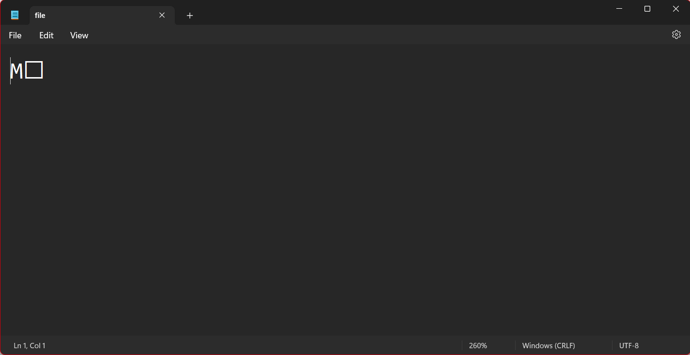
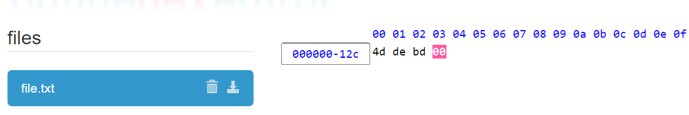

# Семинар 03
*Резюме: Разглеждаме двоични файлове и интерфейса за работа с тях. Разглеждаме различни методи за сериализация на структури в двоични файлове.*

## Режими за работа с файлове
| Режим:             | Ефект:                                                                                                | 
|--------            |------------------------------------------------------------------------------                         |
|std::ios::in        | Отваря файл за четене  (по подразбиране на ifstream)                                                  |
|std::ios::out       | Отваря файл за писане  (по подразбиране на ofstream)                                                  |
|std::ios::binary    | Отваря файл в двоичен режим                                                                           |
|std::ios::trunc     | Ако файлът съществува,  съдържанието му се изтрива след отваряне на поток                             |
|std::ios::app       | Отваря файлът за вмъкване. Поставя put указателят в края. Не се допуска вмъкване преди края на потока |
|std::ios::ate       | Отваря файлът за вмъкване. Поставя put указателят в края. Допуска вмъкване на прозиволни места        |
|std::ios::nocreate  | Отваря за вмъкване, само ако файлът с указаното име съществува.                                       |
|std::ios::noreplace | Отваря за вмъкване само ако файлът с указаното име не съществува.                                     |

Използваме режимите за работа по следния начин:
```cpp
#include<fstream>
int main() {
    // Отваря файл за писане в двоичен режим в който пишем в края.
    std::ofstream outFile("file.txt", std::ios::app | std::ios::binary);
}
```
## Двоични файлове
Какво означава файл да се отвори в двоичен режим? Текстовите файлове са направени за да се четат от хора. Там информацията често е форматирана така, че да се чете лесно и от човек и от машина. Понякога обаче файловете, с които работим, не са предназначени за четене от хора. Такъв тип файлове наричаме двоични файлове.

За да пишем и четем в двоични файлове не използваме операторите за форматиран вход/изход (<<, >>). Както разбрахме те няма да се четат от хора и нямаме особена причина да форматираме информацията. Вместо това използваме:

```
read (char* s, size_t n);
write(const char* s, size_t n);
```
за да пишем и четем. Тези функции записват/прочитат блок памет започващ от s и с дължина n. Функциите приемат char*. Това не ни спира да записваме други типове, но трябва да ги кастнем към тип char*.

## Примери
```cpp
#include<fstream>

int main() {
    std::ofstream outFile("file.txt", std::ios::binary);

    int x = 12443213;

    // &x - вземаме адреса на х, който се каства къв const char*
    outFile.write((const char*)&x, sizeof(x));

    outFile.close();
}
```

Нека погледнем какво съдържа file.txt:


Тези символи на нас не ни говорят нищо, но те представляват байтовете на чеслото, което току що записахме.
Ако го прочетем, ще получим същото число:

```cpp
#include<fstream>
#include<iostream>

int main() {
    std::ifstream inFile("file.txt", std::ios::binary);
    int x = 0;
    inFile.read((char*)&x, sizeof(x));
    std::cout << x;
    inFile.close();
}
```

Hex-viewer-ът е удобен инструмент, който взема файл, и представя всеки байт записан в него като шеснадесетично число. Да видим как изглежда нашия файл като последователност от шеснадесетични числа:



Байтовете се записват в обратна посока и това представлява числото *00bdde4d* в шеснадесетична бройна система. След като го превърнем в десетична виждаме познато за нас число.

## Сериализация на структури в двоични файлове
Нека имаме следната структура:

```c
struct Example {
    int x;
    char data[8];
};
```

Тази структура има фиксиран размер. Идеята тук е, че можем да я запазим във файл само с едно извикване на функцията write.
```cpp
int main() {
    {
        Example e = {10, "abc"};
        std::ofstream outFile("file.txt", std::ios::binary);
        outFile.write((const char*)&e, sizeof(Example)); // Записва sizeof(Example) байта
    }

    {
        Example e1;
        std::ifstream inFile("file.txt", std::ios::binary);
        inFile.read((char*)&e1, sizeof(e1)); // Прочита sizeof(Example) байта
    }
}
```

Това ни дава лесен начин да четем и да записваме структури във файлове.

## Сериализация на структури използващи външен ресурс

## Задача първа - от тема 3 за устен изпит
Да се демонстрира запазване/четене на масив от обекти (от един тип*) във файл.

## Задача втора: 

Да се реализира програма за изглед и модификация на двоични файлове (hex viewer). При стартиране на програмата трябва да се въведе път до двоичен файл и да зареди съдържанието на файла в паметта. След като файлът се е заредил в паметта, трябва да поддържате следните операции:
 
- Преглед на файла (view)  отпечатва байтовете на файла (в шестнайсетична бройна система). След това да се отпечатат интерпретацията на байтовете като символи. Ако байтът отговаря на малка/голяма латинска буква, то да се отпечата символа. В противен случай да се отпечатва точка.  
-  Промяна на байт по индекс (change) 
-  Премахване на последния байт (remove) 
-  Добавяне на байт в края (add)
-  Запазване на промените в същия файл (save) 
-  Запазване на промените в друг файл (save as)

Нека имаме двоичен файл, myData.dat, който се е получил след изпълнението на следния c++ код: 
```cpp
int x = 25409;
ofstream file(“myData.dat”, ios::binary);
file.write( (const char*)&x, sizeof(x));
```

Да се реализира прост интерфейс, с който да се извикват написаните фунцкии през конзолата.

**Важно** Не се ползволява използването на stl, както и std::hex.

**Пример** (входът от потребителя започва с '>'):

```
Enter a file path:
> myData.dat
File loaded successfully! Size: 4 bytes 
> view
41 63 00 00
A  c  .  . 
>change 1 65 
Operation successfully executed!
> view 
41 65 00 00 
A  e  .  . 
> remove 
> view
 41 65 00 
 A  e   . 
>save 
File successfully saved
```

**Забележка:** Не се изисква поддържането на конзолен интерфейс. Можете само да реализирате функциите и да ги изпробвате в main функцията.

---
Голяма част от примерите и задачите са взаимствани от [тук](https://github.com/Angeld55/Object-oriented_programming_FMI/blob/master/Week%2003/readme.md).