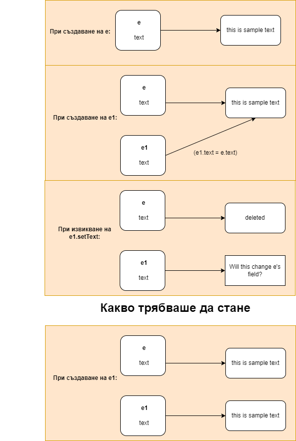

# Rule of four - голямата четворка
Работата с динамична памет е отговорност на програмиста. Естествено идва въпроса "какво правим когато използваме динамична памет в класове?"

## Въведение
Следните четири функции се генерират от компилатора ако не ги напишем:
* Конструктор по подразбиране
* Конструктор за копиране 
* Оператор за присвояване
* Деструктор

Всяка една от тези функции извиква **рекурсивно** същите функции върху член-данните.

## Къде идва проблемът
Да разгледаме следния клас:

```cpp
class Example {
private:
	char* text;
public:
	Example(const char* str) {
		size_t textSize = strlen(str);
		text = new char[textSize] + 1;

		strcpy(text, str);
	}

	const char* getText() const { return text; }

    void setText(const char* str) {
        if(str == nullptr || str == text)
            return;
        
		delete[] text;
		size_t textSize = strlen(str);
		text = new char[textSize + 1];
		strcpy(text, str);
	}
};
```

За него няма генериран default конструктор, нопеже сме разписали конструктор с параметри, но има генериран деструктор, констряктор за копиране и оператор за присвояване.

Какви са проблемите тук:
* Нямаме деструктор. Това е отечка на памет.
* Копирането е некоректно:

```cpp
int main() {
	Example e("this is sample text");

	std::cout << e.getText() << std::endl;

	Example e2 = e;

	e2.setText("Will this change e's field?");

	std::cout << e.getText() << std::endl << e2.getText();
}
```

Изход:

`this is sample text`

`▌▌▌▌▌▌▌▌▌▌▌▌▌▌▌▌▌▌▌▌▌▌▌▌<╠╦IC`

`Will this change e's field?`


Трябва да създадем нова памет. Тази памет има същата стойност като паметта на e, но се намира на различно място. Избирайки този подход сме сигурни, че променяйки едното поле няма да променим другото.

Очевидно не сме доволни с имплементацията, която компилатора ни предлага. Нека разпишем функциите така, че нещата да работят:

```cpp
class Example {
private:
	char* text;

public:
	Example(const char* str) {
		size_t textSize = strlen(str);
		text = new char[textSize + 1];

		strcpy(text, str);
	}

	// Копиращ окнструктор
	Example(const Example& other) {
		copyFrom(other);
	}

	// Оператор=
	Example& operator=(const Example& other) {
		if (this != &other) {
			free();
			copyFrom(other);
		}
		return *this;
	}

	const char* getText() const { return text; }
	
	void setText(const char* str) {
        if(str == nullptr || str == text)
            return;

		delete[] text;
		size_t textSize = strlen(str);
		text = new char[textSize + 1];
		strcpy(text, str);
	}

	~Example() {
		free();
	}

private:
	void copyFrom(const Example& other) {
		text = new char[strlen(other.text) + 1];
		strcpy(text, other.text);
	}

	void free() {
		delete[] text;
	}
};
```