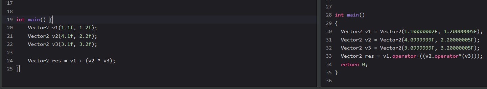
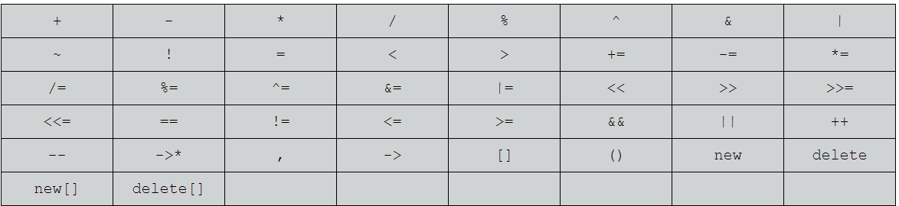
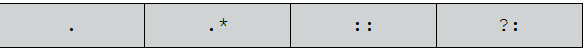

# Семинар 07.04.2023

## Предефиниране на оператори
Нека работим със следната структура:

```cpp
struct Vector2 {
    float x;
    float y;

    Vector2(float argx, float argy) : x{argx}, y{argy} {}
};
```

Работейки с нея ни е нужно да представим интерфейс за събиране и умножение на два вектора. С познатите ни техники това може да се случи по следния начин:

```cpp
struct Vector2 {
    float x;
    float y;

    Vector2(float argx, float argy) : x{argx}, y{argy} {}

    Vector2 add(const Vector2&) const;
    Vector2 multiply(const Vector2&) const;
};
```

Използвайки тези методи все по често виждаме код от сорта на:
```cpp
v1.add(v2.multiply(v3));
```
Няма ли да е по лесно просто да напишем
```cpp
v1 + (v2 * v3)
```
Езикът ни позволява да предефинираме операторите `+` и `*` за да можем да поддържаме този синтаксис. Какво се променя обаче, каква е разликата между операторите и функциите? Разликата е **синтактична**.

Кодът който се генерира е:



## Какво е оператор в c++?
Очудващо много неща Част от нещата, които могат да бъдат предефинирани:



Част от операторите, които не могат да бъдат предефинирани:


## Приятелски функции
Понякога е полезно една функция да може да работи директно с член-данните на клас. Тогава тя се декларира като приятелска. Приятелските функции са нещо типично за с++ (както и предефинирането на оператори в някакъв смисъл) и с тях трябва да се вниава.

Както разбрахме `operator+` е функция. Нищо не ни пречи да я направим приятелска:

```cpp
struct Vector2 {
private:
    float x;
    float y;
public:
    Vector2(float argx, float argy) : x{argx}, y{argy} {}
    
    // Вече няма конст. Защо?
    friend Vector2 operator+(const Vector2& lhs, const Vector2& rhs);
};

// Няма проблем да работим с член-данните на структурата.
Vector2 operator+(const Vector2& lhs, const Vector2& rhs) {
  	return Vector2(lhs.x + rhs.x, lhs.y + rhs.y);
}
```

## Задача 1
Реализирайте клас Nvector, който ще се използва за работа с математически вектор. Предефинирайте оператори със следната функционалност:

* Събиране на вектори                           (`operator+`).
* Изваждане на вектори                          (`operator-`).
* Умножение на вектор със скалар                (`operator*`).
* Проверка дали два вектора са успоредни        (`operator||`)
* Проверка дали два вектора са перпендикулярни. (`operator%`)
* Достъп до произволен елемент на вектор.       (`operator[]`)
* Вход и изход от потоци.                       (`operator<<`, `operator>>`)
* Взимане на дължина на вектор.