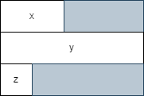
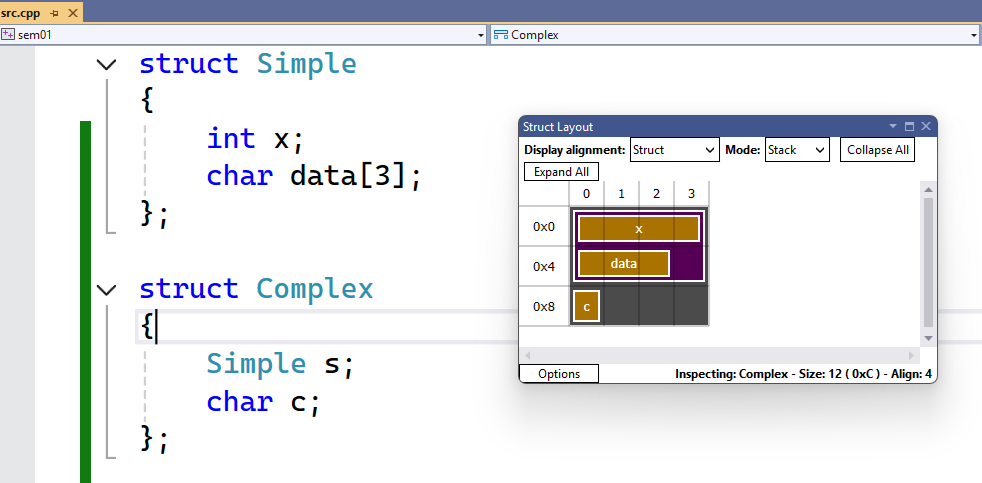

# Втори семинар по обектно ориентирано програмиране - 27.02.2025

## Резюме
1. Допълнение към структури - подравняване, задачи и примери.
2. Потоци. Файлове - текстови файлове (част 1)

## Представяне на структури в паметта
Структурите заемат памет. Да разгледаме следния пример:
```cpp
struct Example 
{
    short x;
    int y;
    char z;
};
```
Какъв е размерът на тази структура? Ако не сме се сблъсквали с този проблем отговорът може би би бил 7. Все пак имаме 2 байта от *x* още 4 байта от *y* и още 1 байт от *z*. Правилният отговор тук обаче е 12. Но защо?

Това се случва заради **подравняването** или така наречения **padding**. Нещата интуитивно изглеждат така:



като сивите байтове са така наречените **padding bytes**. Накратко, имаме нужда от тях за да може процесора да чете паметта по - бързо. Модерните процесори четат паметта на "парчета" (често по 4 или 8 байта) а не байт по байт. Това е и причината да съществува изискването, че адреса на всяка променлива трябва да е кратен на размера ѝ.

Примерно, ако имахме следната структура:

```cpp
struct Example 
{
    short x;
    double y;
    char z;
};
```

Нейния размер би бил 24. **Интуитивно** нещата биха изглеждали по следния начин:


Разбира се, това представяне е **интуитивно**, понеже паметта е **последователна**.

Подравняването се извършва автоматично от компилатора. Възможно е обаче да спестим памет ако разположим променливите си по подходящ начин. Нека пренапишем структурата така:

```cpp
struct Example 
{
    int y;
    short x;
    char z;
};
```
Сега вече размерът ѝ е 8. Това може да проверите като използвате следния код:
```cpp
int main() 
{
    std::cout << sizeof(Example); // Връща размера на структурата.
}
```
Защо сега използваме по-малко памет? Поглеждайки отново представянето имаме:

 

Тоест, чрез просто пренареждане на данните спестихме 4 байта памет.

Оптимално подравняване обикновено достигаме разполагайки член-данните си в нарастващ (или намаляващ) ред.

Следните две структури имат еднакво подравняване.

```cpp
struct Simple
{
	int x;
	char data[3];
};

struct SimpleSecond
{
	int x;
	char c1;
	char c2;
	char c3;
};
```

За подравняването на структура, която в себе си има структура трябва ба внимаваме за следните неща:
1. Паметта на вътрешната структура не може да се променя - тоест ако имаме 1 свободен байт падинг той остава свободен - компилаторът няма да "вмъкне" променлива вътре дори да има възможност.
2. Подравняването не става по размера на структурата а по размера на най - големия примитивен тип във външната или вътрешната структура.

Пример за тези две особености:


В случая:
1. Въпреки, че в паметта на Simple има едно свободно място, то остава недокоснато (може би очевидно, но често бъркано).
2. Подравняването не става по размера на Simple а по размера на най - големия прост тип (в случая int).

## Задача първа
От стандартния вход се въвеждат n триъгълника. Да се изведат лицата им в сортиран ред.

## Потоци, но накратко
Поток в С++ е абстракция за последователност от информация (символи) която влиза или излиза от нашата програма. Примери за потоци са обектите `std::cin` и `std::cout`, които осъществяват връзката между програмата и стандартния вход/изход.
Разбира се, можем да използваме потоците не само за да осъществим връзка между програмата и стандартния вход/изход.

## Работа с файлове. Отваряне на поток за четене/писане във файл.
Езикът С++ ни позволява гъвкаво да работим с файлове. Всеки файл е последователност от байтове. Можем да използваме потоци за да четем и пишем в тях. Разбира се, вече не използваме `std::cin` и `std::cout`, но потоците, които ще използваме, споделят доста общи неща с тях.

Библиотеката която използваме за работа с файлови потоци е `<fstream>`.
Обектите, които използваме, за да работим с файлове са:

* <b> std::ifstream - поток за четене от файл. </b>
* <b> std::ofstream - поток за писане във файл. </b>

Ще забележите, че интерфейсът на тези потоци е доста подобен на този на `std::cin` и `std::cout`. Примерно, нека се опитаме да запишем нещо във файл:

```cpp
#include<fstream>

int main() 
{
    // Отваряме поток за писане във файл. Ако във файла има информация тя се затрива.
    std::ofstream outFile("test-file.txt");

    // Разбира се, трябва да проверим дали файлът е отворен успешно.
    if(!outFile.is_open()) 
    {
        return -1;
    }
    
    // Пишем по същия начин както при cout.
    outFile << "Hello files";

    // Можем също така да добавим един символ в края.
    outFile.put("!");

    // Затваряме файла.
    outFile.close();
}
```

Интерфейсът за четене от файл също наподобява този на cin. Все пак имаме добре работеща логика за четене/писане от конзола, защо да не я преизползваме и за файлове?

```cpp
#include<fstream>

int main() 
{
    std::ifstream inFile("test-file.txt");

    if(!inFile.is_open())
    {
        return -1;
    }

    char buff[64];

    inFile.getline(buff, 64, '\n');

    std::cout << "First line of our file is: << buff;

    char ch = inFile.get(); // Вземи следващия символ от файла.

    inFile.close();
}
```

След като отворим поток за четене/писане във файл е нужно да проверим състоянието му (дали е отворен). Ако не е отворен, то няма смисъл да работим с обекта.

## Интерфейс на потоците
В показаните примери видяхме част от интерфейса на потоците. Нека внимателно разгледаме какво използвахме:
* оператор `<<` - **Форматиран** вход в поток.
* оператор `>>` - **Форматиран** изход към поток.
* .get()        - Връща първия символ от потока като **неформатиран** символ.
* .put(char c)  - Поставя c в потока като **неформатиран** символ.

Има още една функция, която си струва да разгледаме. Функцията `getline(char* buff, size_t size)` ни позволява да вземем `size` символи наведнъж и да ги запишем в буфера `buff`. Пример:

```cpp
#include <iostream>

int main()
{
    char buff[8] = {};
    std::cin.getline(buff, 8);
    std::cout << buff;
}
```
Когато въведем `Hello world!` в конзолата като изход получаваме `Hello w`. Това са седем символа (заедно с '\0' стават 8).
Нека разгледаме друг пример:

```cpp
#include <iostream>

int main()
{
    char buff[64] = {};
    std::cin.getline(buff, 64);
    std::cout << buff;
}
```
Сега, при вход `Hello world!`, получаваме изход `Hello world!`. Но защо? Защо програмата не чака останалите символи, които трябва да прочете? 

Функцията `getline`, използвана по този начин, спира не само когато достигне лимита на символите. Спира и когато срещне първия символ за нов ред (примерно `\n`). Реално `getline` прави точно това, което името подсказва - взема ред. Ако редът е твърде дълъг го реже до предвалително зададен брой символи.

По подразбиране терминитащия символ е символът за нов ред, но можем да променим това. Ако имаме следното извикване:
```cpp
getline(buff, 64, 'a');
```
функцията ще пише в `buff` докато:
* Не прочете 64 символа
* Не срещне символ 'a'
* Не стигне края на потока

## Какво може да се обърка
Нека разгледаме следния пример:
```cpp
#include<iostream>

int main() 
{
    int x = 0;
    char data[8];
    
    std::cout << "Enter x: ";
    std::cin >> x;
    std::cout << std::endl << "Enter data: ";
    std::cin.getline(data, 8, '\n'); // взема първите 8 символа или докато или докато не види нов ред.

    std::cout << x << std::endl << data;
}
```
Тази програма първо въвежда от стандартния вход числото след това прочита осем символа от стандартния вход и ги извежда на стандартния изход. Въвеждаме числото 8, натискаме бутона `enter` и се опитваме да пишем. Изходът не е точно това, което очакваме:


Цялата информация (в случая последователност от символи) се движи точно като поток от нашата конзола към нашата програма.

Как изглежда потокът в случая:
```
8 \n
```
В случая програмата прави точно каквото сме ѝ казали. Първо прочита числото 8 от стандартния вход и след това чете докато не види първия символ за нов ред.

Какво можем да направим? Можем да извадим символа за нов ред от потока. Това можем да направим с функцията `get()`

```cpp
#include<iostream>

int main() {
    int x = 0;
    char data[8];
    
    std::cout << "Enter x: ";
    std::cin >> x;
    std::cin.get();

    std::cout << std::endl << "Enter data: ";
    std::cin.getline(data, 8, '\n');

    std::cout << x << std::endl << data;
}
```
Сега това работи точно както очаквахме.

`.get()` взема първия байт от потока. Какво правим ако искаме да игнорираме 100 байта? Можем да ги запишем с getline в някакъв буфер, но така заделяме ненужен буфер. Можем да въртим цикъл от 0 до 100 и да викнем 100 пъти `get()`. Или можем да използваме функцията `ignore()` по следния начин:
* ignore() - пропуска първия символ от потока. Разликата между ignore и get e, че get() връща символа.
* ignore(size_t n) - пропуска n символа от потока (или докато не стигне до края на потока).
* ignore(size_t n, char delim) - пропуска n символа от потока (или спира когато види delim) (или спира когато стигне края на потока).

## Флагове на състояния на поток
При работа с потоци е възможно да възникнат различен тип грешки. За да имаме максимално ясна представа какво се случва с потока ни разполагаме с четири състояния на потоците:
* good - Няма грешки.
* bad  - Грешка при четене/писане в потока.
* fail - Последната входно/изходна операция е невалидна.
* eof  - Достигнат е края на потока.

Четирите състояния можем да проверим използвайки предоставени функциите:

```cpp
std::cin.good();  // дали потока е в състояние good?
std::cin.bad();   // дали потока е в състояние bad?
std::cin.fail();  // дали потока е в състояние fail?
std::cin.eof();   // дали потока е в състояние eof?
```

Примерно:
```cpp
#include <iostream>
#include <fstream>
int main()
{
    int x = 0;
    std::cin >> x; // Вход: 4
    std::cout << (std::cin.good()) << std::endl // истина
    std::cin >> x; // Вход: a
    std::cout << (std::cin.fail()) << std::endl; // истина
    std::cin.clear(); // Връща състоянието на good
}
```
Примери кога е вдигнат `eof()` флага ще видим на задачи. `bad()` флага означава, че се е случила фатална грешка. За него също ще видим примери скоро.

Кой флаг е вдигнат се разбира като се манипулират битовете на число. За да се вдигне флаг всъщност се вдига бит. Функциите проверяват дали съответния бит е вдигнат.

## Задача втора
Да се напише програма, която принтира сама кода си.