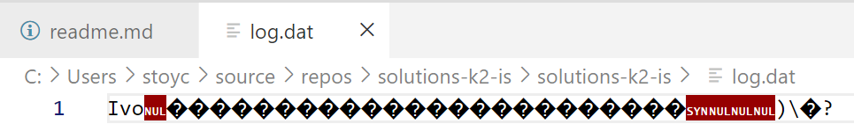

# Пети семинар по обектно ориентирано програмиране - информационни системи 20.03.2025

## Резюме
1. Преговор и задачи за сериализация и десериализация на обекти във файлове.
2. Член функции. Модификатори за достъп. Класове. Конструктори и деструктори.

## Сериализация и десериализзация на структури
* Сериализация - Процесът по превръщане на структура (клас, обект) в последователност от байтове, която може да се запише във файл (предаде по мрежа, запише в база от данни...).
* Десериализация - Процесът по рекунстроиране на структура, която е била сериализирана, обратно към първоначалната ѝ форма.

Нека разглидаме следния пример:
```cpp
#include <iostream>
#include <cstring>
#include <fstream>

#pragma warning (disable : 4996)

struct Student
{
    char name[25];
    unsigned age;
    float height;
};

Student createStudent(const char* name, unsigned age, float height)
{
    Student toReturn;
    strcpy(toReturn.name, name);
    toReturn.age = age;
    toReturn.height = height;

    return toReturn;
}

void serializeStudent(std::ofstream& outFile, const Student& st)
{
    outFile.write((const char*)&st, sizeof(st));
}

void deserializeStudent(std::ifstream& inFile, Student& st)
{
    inFile.read((char*)&st, sizeof(st));
}

void printStudent(const Student& st)
{
    std::cout << st.name << " " << st.age << " " << st.height << std::endl;
}

int main()
{
    {
        Student st = createStudent("Ivo", 22, 1.87f);

        std::ofstream outFile("log.dat", std::ios::binary);
        serializeStudent(outFile, st);
    }

    {
        Student st1;
        std::ifstream inFile("log.dat", std::ios::binary);
        deserializeStudent(inFile, st1);
        printStudent(st1);
    }
}
```

Това е един начин да сериализираме обект във файл и после да го десериализираме. Разбира се, не е единствен, има много формати за сериализация на обекти.
Идеята тук е следната - записваме директно байтовете на структура в двоичен файл. Понеже структурата има краен размер нямаме от какво да се притесняваме - знаем точно колко байта да запишем и следователно колко да прочетем.
Файлът изглежда по следния начин:



## Сериализация и десериализация на структури с външен ресурс
Какво правим когато не знаем колко е истинския размер на структурата? Примерно ако модифицираме структурата по следния начин:

```cpp
#include <iostream>
#include <cstring>
#include <fstream>

#pragma warning (disable : 4996)

struct Student
{
    char* name = nullptr;
    unsigned age;
    float height;
};

Student createStudent(const char* name, unsigned age, float height)
{
    Student toReturn;
    size_t length = strlen(name) + 1;
    toReturn.name = new char[length + 1];

    strcpy(toReturn.name, name);
    toReturn.age = age;
    toReturn.height = height;

    return toReturn;
}

void freeStudent(Student& st)
{
    delete[] st.name;
}
```
Очевидно, ако извикаме функцията `write` върху този обект няма да се запише името му. Как тогава сериализираме обекта? Можем да използваме следната идея:
* Запиши дължината на името му
* Запиши името му
* Запиши останалите член данни

Когато четем можем да направим симетричното:
* Прочети дължината на името и задели толква памет
* Прочети името
* Прочети останалите член данни

```cpp
#include <iostream>
#include <cstring>
#include <fstream>

#pragma warning (disable : 4996)

struct Student
{
    char* name = nullptr;
    unsigned age;
    float height;
};

Student createStudent(const char* name, unsigned age, float height)
{
    Student toReturn;
    size_t length = strlen(name) + 1;
    toReturn.name = new char[length + 1];

    strcpy(toReturn.name, name);
    toReturn.age = age;
    toReturn.height = height;

    return toReturn;
}

void freeStudent(Student& st)
{
    delete[] st.name;
}


void serializeStudent(std::ofstream& outFile, const Student& st)
{
    size_t nameLen = strlen(st.name);
    outFile.write((const char*)&nameLen, sizeof(nameLen));
    outFile.write(st.name, nameLen);
    outFile.write((const char*)&st.height, sizeof(st.height));
    outFile.write((const char*)&st.age, sizeof(st.age));
}

Student deserializeStudent(std::ifstream& inFile)
{
    Student st;

    size_t nameLen = 0;
    inFile.read((char*)&nameLen, sizeof(nameLen));

    st.name = new char[nameLen + 1] {};
    inFile.read(st.name, nameLen);
    st.name[nameLen] = '\0';

    inFile.read((char*)&st.height, sizeof(st.height));
    inFile.read((char*)&st.age, sizeof(st.age));

    return st;
}

void printStudent(const Student& st)
{
    std::cout << st.name << " " << st.age << " " << st.height << std::endl;
}

int main()
{
    {
        Student st = createStudent("Ivo", 23, 1.87f);

        std::ofstream outFile("file.dat", std::ios::binary);
        serializeStudent(outFile, st);
        freeStudent(st);
    }

    {
        std::ifstream inFile("file.dat", std::ios::binary);
        Student st = deserializeStudent(inFile);
        printStudent(st);
        freeStudent(st);
    }
}
```

## Задача 1
Разглеждаме следните две понятия:
* Цена:
    * Положително число.
    * Валута (3 символа). 
* Модификация
    * Име на модификацията - произволна дължина
    * Процент - показва с колко процента увеличаваме или намаляваме цената.
    * Фиксирана стойност - показва с каква стойност увеличаваме или намаляваме цената
    * Тип - показва дали увеличаваме или намаляваме цената

Във всеки един момент може да променим цената или с процент или с фиксирана стойност. 

От файл `prizes.dat` се четат множество от цени.
От файл `modifications.dat` се четат множество модификации.

Всяка модификация се прилага върху всяка цена. Да се изведат цените преди и след модификациите.

## Член-функции
Член-функциите са функции, които работят с член-данните на структурата (или класа). 

```cpp
#include <iostream>

struct Example
{
    int number;

    bool isNumberPositive() const
    {
        return number > 0;
    }
};

int main()
{
    Example e;
    e.number = 10;
    std::cout << e.isNumberPositive();
}
```

> Няма значение колко член-функции имаме. Размерът на класа/структурата зависи само от променливите.

* isNumberPositive е функция, която е обвързана със структурата Example. Тя може да се викне от всеки обект от тип Example и отговаря на въпроса дали number е положително. От тук можем да си направим извод, че **член-функциите работят с член-данните на класа.**

### Какво е const?
* Когато проверяваме дали number е по - голямо от 0 това не включва промяна на нито една от член-данните. Следователно можем да декларираме функцията като const, тоест, че тя не променя член-данните. Защо ни помага това?

```cpp
void f(const Example& e) 
{
    // Ако не е конст не можем да я викаме.
    // Все пак как ще викаме функция, която може да промени
    // обекта когато обекта е константен?
    e.isNumberPositive(); 
}
```

Ако имаме член функция, която променя член-данните на обекта, то тя не се декларира като `const`
```cpp
struct Example
{
    int x;

    void setX(int newX)
    {
        x = newX;
    }
};
```
В случая функцията `setX` променя член-данните на структурата `Example` и не е декларирана като `const`. Тя не може да се извиква от обекти, които са били декларирани като `const`.


## Модификатори за достъп.
```
private - Прави член-данните невидими за външния свят.
protected - Скоро.
public - Всеки може да достъпва член-данните.
```

```cpp
struct Example 
{
private:
    int privateIndex;
public:
    int publicIndex;
};

int main() 
{
    Example e;
    e.privateIndex = 0; // Грешка!
}
```
## Класове. Разлики между класове и структури.
В С++ имаме два начина да описваме информация. Можем да използваме познатите структури `struct` или класове `class`. Разликата е, че по подразбиране в структурите член-данните са публични а в класовете са `private`.

```cpp
#include <iostream>

class Example1
{
    int x;
};

struct Example2
{
    int x;
};

int main()
{
    Example1 e1;
    std::cout << e1.x << std::endl; // Грешка!
    Example2 e2;
    std::cout << e2.x << std::endl; // Няма проблем, видимо по подразбиране.
}
```

## Жизнен цикъл на обект. Конструктор и деструктор.
Всеки обект има жизнен цикъл.
1. Създаване на обект.
2. Използване на обекта.
3. Унищожаване на обекта.

## Конструктори
Понягока искаме когато създаваме обект да имаме **логика по която той се създава**. Функцията, която имплементира тази логика наричаме **конструктор**.

```cpp
class Entity 
{
private:
    int x;
    int y;
    char data[8];
public:
    // Това се нарича конструктор по подразбиране
    // или по често срещан като default constructor
    Entity() 
    {
        std::cout << "Called constructor" << std::endl;
        x = 42;
    }

    // Можем да имаме и конструктор с параметри
    Entity(int argx, int argy) 
    {
        x = argx;
        y = argy;
    }
};

int main() 
{
    // Точно сега се вика default конструктора
    Entity e;

    // Конструктор с аргументи
    Entity e1(10, 20);
}
```

**Ако не създадем никакви конструктори компилаторът създава конструктор по подразбиране.** Можем да имаме различна логика по създаване на обекти следователно можем да имаме и конструктори с параметри.
* Ако създадем само конструктор с параметри **default конструктор не се създава.*

Пълния набор с примери за конструктори е качен в `constr-examples.cpp`.

## Деструктори
Деструктора е функция, която се извиква при унищожаване на обекта. Често деструктора се използва за освобождаване на някакъв външен ресурс. При статични обекти унищожаването става когато приключи живота на обекта (най-често в края на скоупа), при динамични при извикване на `delete`. Примери за това кога и как се извиква деструктор можете да намерите в `destr-examples.cpp`.

Синтактично, декларираме деструктор по следния начин:
```cpp
class Entity
{
public:
    ~Entity()
    {
        // destructor!
    }
};
```

За разлика от конструкторите, деструкторът е единствен. Той нито има нужда от аргументи нито връща стойност.