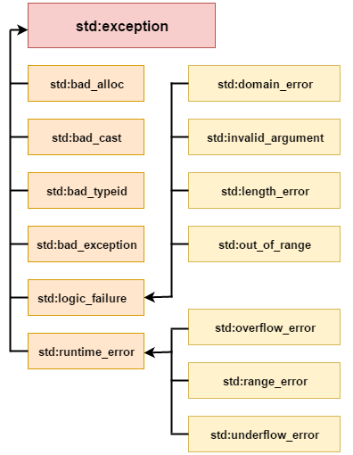

# Седми семинар по обектно ориентирано програмиране - 03.04.2025

## Състояние на обекти. Поддържане на състояние на обекти.
Работейки с обекти в С++ имаме няколко избора когато е възможно да се въведат невалидни данни:
1. Да позволя ваме невалидните данни да "счупят" обекта.
    * Обикновено тогава се предоставя функция, която проверява дали обекта е валиден или не. Пример за това са потоците и тяхните състояния.

2. При всяка операция да валидираме данните и ако са валидни да ги приемаме. В противен случай обекта остава в последното валидно състояние.

Каквото и да правим е силно желателно да поддържаме обектите си във валидно състояние.

## Изключения
Във всяка една програма могат да се появят логически грешки или грешки по време на изпълнение на програмата. Eдин пример за такава ситуация е функцията ```writePrices```, която написахме в пети семинар.

```cpp
WriteStatus writePrices(const char* filePath, const Price* prizes, unsigned size)
{
	if (prizes == nullptr)
	{
		return WriteStatus::Nullptr;
	}

	std::ofstream outFile(filePath, std::ios::binary);

	if (!outFile.is_open())
	{
		return WriteStatus::FileNotFound;
	}

	outFile.write((const char*)(prizes), size * sizeof(Price));

	return WriteStatus::OK;
}
```
В случая грешките, които могат да се случат са:
1. Подаден нулев указател.
2. Файл, към който нямаме права за писане.

Как се справяме с подобни грешки? В случая е използван специален enum, който връща статус. Други начини за работа с такива грешки е:
1. Връщане на специален код за грешка (подобен на метода с enum).
2. Използване на assert.
3. Изключение (exceptions).

В повечето сцeнарии предпочитания начин да се справим с грешки е да използваме изключения.

## Кога точно използваме изключения
В езика С (и не само) грешките се обработват или чрез връщане на стойност, която представлява код за грешка или чрез променяне на стойността на някоя глобална променлива, която извикващия функцията може да прочете. И в двата случая зависи от извикващия функцията да провери дали има грешка и да реагира на нея.

Ако не реагираме програмата ни може да продължи с некоректни данни (или да сегментира).

Изключенията се появяват със С++ и имат следните свойства:
* Изключението ни принуждава да се справим с проблема.
* Изключението отива до функцията която може да се справи с него. Междинните функции оставят изключението да продължи.
* Изключенията използват механизъм наречен stack unwinding, който унищожава всички обекти в скоупа по добре дефинирани правила.

Нека разгледаме как се хвърля изключение:

```cpp
void writePrices(const char* filePath, const Price* prices, unsigned size)
{
	if (prices == nullptr)
	{
		throw std::invalid_argument("Nullptr passed to writePrices.");
	}

	std::ofstream outFile(filePath, std::ios::binary);

	if (!outFile.is_open())
	{
        std::ostringstream oss;
        oss << "No permissions to open the file " << filePath;
		throw std::runtime_error(oss.str());
	}

	outFile.write((const char*)(prices), size * sizeof(Price));
}
```
След като се хвърли изключението то ще започне да търси първата функция от стека, която може да се справи с него.

А как може функция да се справи с изключение? С изключения се справяме използвайки try-catch блокове:

```cpp
try
{
    writePrices("file.dat", prices, size);
}
catch(const std::invalid_argument& e)
{
    // Handle exceprion.
}
catch(const std::runtime_error& e)
{
    // Handle exception.
}
catch(...)
{
    // Catch any other type of exception.
}
```
Каква е идеята тук? Кодът в try се изпълнява нормално. Ако не хвърли изключение - супер. Ако хвърли се изпълнява кодa в catch. В случай, че имаме много изключения, които могат да се хвърлят можем да имаме няколко catch блока.

Би било добре да си зададем въпроса какво е std::exception или std::out_of_range? Това са класове. Ролята на тези класове е да бъдат хвърляни като грешки и след това хващани. 

Това означава, че можем да хвърляме като грешки и наши класове? Можем. В някакъв смисъл има вероятност да се хвърли обект, който не предполагаме дори, че съществува. Синтаксисът `catch(...)` хваща всичко. Разбира се, ако се хвърли out_of_range той ще бъде хванат от първия catch блок.

Ако не се намери подходящ catch блок програмата терминира.

Нека разглидаме още един пример за да стане напълно ясно:
```cpp
#include <iostream>

void bar()
{
    throw std::exception("Oh no...");
}

void foo()
{
    bar();
}

int main()
{
    try
    {
        foo();
    }
    catch (const std::exception& e)
    {
        std::cout << e.what();
    }
}
```
В случая foo извиква bar която хвърля изключение. foo не знае как да се справи с него (няма try-catch блок) и го предава на main. Той от друга страна знае как да се справи с него и на стандартния изход се извежда очакваното съобщение.

Стандартната библиотека ни предоставя семейство от класове, които можем да преизползваме за да хвърляме грешки.



## Какво можем какво не можем и какво трябва да хвърляме.
Можем да не използвам предоставените от стандартната библиотека обекти и да хвърлим наши обекти.
```cpp
#include <string>
#include <iostream>

class MyException
{
    std::string str;
public:
    MyException(const std::string& str) : str(str) {}

    const std::string& what() const
    {
        return str;
    }
};

void bar()
{
    throw MyException("Oh no...");
}

void foo()
{
    bar();
}

int main()
{
    try
    {
        foo();
    }
    catch (const MyException& e)
    {
        std::cout << e.what();
    }
}
```

Обектите, които хвърляме, трябва да имат дефиниран копиращ конструктор (и move конструктор, но за това скоро). Ако изтрием копиращия конструктор по следния начин:
```cpp
MyException(const MyException&) = delete;
```
ще получим грешка.

## Stack unwinding
В модела на С++ изключенията ```throw``` намира първия ```catch``` който може да се справи с хвърления тип. Когато този ```catch``` е достигнат всички променливи, които са в скоуп между хвърлящата и хващащата функция, биват унищожени. Този процес се нарича ```stack unwinding```.

В контекста на класове **деструкторите се извикват.**

```cpp
#include <iostream>

class Dummy
{
public:
    Dummy() { std::cout << "Default ctor" << std::endl; }
    ~Dummy() { std::cout << "Dtor" << std::endl; }
};

void g()
{
    throw Dummy();
}

void f()
{
    Dummy d;
    g();
}

int main()
{
    Dummy d;
    try
    {
        f();
    }
    catch (...)
    {

    }
    std::cout << "End" << std::endl;
}
```

## Конструктори и деструктори в класове
Добра идея ли е да хвърляме изключения в конструктори? А в деструктори?

Езикът ни позволява и двете. За деструкторите можем със сигурност да кажем, че **изключения не се хвърлят!**. Когато се хвърли изключение приемаме, че е възможно деструктора на класа да се извика. Какво става обаче когато и той хвърли изключение? При две изключения програмата терминира. Не искаме това да се случи понеже можем да имаме загуба на информация от други класове, чиито деструктори не са се извикали.

Когато в конструктора се подадат невалидни данни, често е добра практика да хвърлим изключение. Така се подсигуряваме, че обектите ни ще са винаги валидни след като са построени.

```cpp
void f()
{
  X x;             // If X::X() throws, the memory for x itself will not leak
  Y* p = new Y();  // If Y::Y() throws, the memory for *p itself will not leak
}
```

## За new и изключенията
При извикване на new, ако нямаме достатъчно памет, се хвърля изключение ```std::bad_alloc```. Нека проверим какво прави следния код:
```cpp
while (true)
{
	try
	{
		int* data = new int[100000000ul] {};
	}
	catch (const std::bad_alloc& e)
	{
		std::cout << e.what();
		std::cin.get();
	}
}
```

След известно време паметта, която процеса може да задели, ще свърши. Тогава ще се хвърли `std::bad_alloc` и ще се уведоми потребителя, че памет няма.

Трябва ли да пишем `try-catch` блокове около всяко `new`? Не разбира се. Когато се хвърли грешката паметта не отича. Дори да излезем от функцията единственото, което трябва да знаем е, че има някъде `try-catch` блок, който може да обработи грешката ни.

Ако такъв `try-catch` блок няма, то програмата ще терминира. Това (понякога) може и да е желан ефект, но често ще доведе до проблеми.

Желателно е, използвайки изключения, да се подсигурим, че всяко изключение, което може да бъде хвърлено, ще бъде хванато на някое място.
Обратно към примера с `new`, какво може да се обърка?

```cpp
void foo()
{
    int* ptrOne = new int[10000000ul] {};
    int* ptrTwo = new int[10000000ul] {};

    // doing something...
}

int main()
{
    try
    {
        foo();
    }
    catch(const std::bad_alloc& e)
    {
        // handle the exception.
    }
}
```

В този код имаме проблеми. Ако `ptrOne` хвърли изключение, сме добре. Ако обаче `ptrTwo` хвърли `ptrOne` изтича. Как можем да се справим с това?

```cpp
void foo()
{
    int* ptrOne = new(std::nothrow) int[10000000ul] {};
    int* ptrTwo = new(std::nothrow) int[10000000ul] {};

    if(ptrOne == nullptr || ptrTwo == nullptr)
    {
        delete[] ptrOne;
        delete[] ptrTwo;

        throw std::bad_alloc("Unable to allocate enough memory");
    }

    // doing something...
}
```

Подавайки `std::nothrow` на `new` инструктираме оператора да не хвърля изключение а при провал на операцията да върне `nullptr`.

Та, накратко:
1. Проблем ли е да използваме `new` без `try-catch` - Не.
2. Проблем ли е да използваме `new` без да се подсигурим, че ресурсите, заделени преди него, могат д не се освободят коректно след хвърлена грешка - да. това подсигуряване може да стане с `std::nothrow` или с `try-catch` блок.

## Exception safety
В C++ имаме четири нива на exception safety:

1. No-Throw Guarantee
    * Функцията гарантира, че никога няма да хвърли грешка.
    * Функцията се маркира с ключовата дума `noexcept`.
    * Обекта остава валиден след изпълнението на функцията.

2. Strong Exception Safety
    * Ако се появи изключение функцията обещава, че състоянието на програмата (или обекта) няма да се промени.

3. Basic Exception Safety
    * Програмата остава във валидно състояние (без отечки и тн), но някои данни могат да бъдат променени.

4. No Exception Safety 
    * Ако функцията хвърли не обещаваме нищо.

| Guarantee Type         | Ensures No Throw? | Ensures Rollback? | Leaves Object Valid? |
|------------------------|------------------|------------------|------------------|
| **No-Throw**   | Yes | Yes | Yes |
| **Strong Safety**        | No  | Yes | Yes |
| **Basic Safety**         | No  | No  | Yes |
| **No Safety**  | No  | No  | No |

## Задача първа
Във файла `rates.txt` са дадени обменните курсове на някои валути. Да се напише клас, който представлява портфолио. В портфолиото се съдържат записи, представляващи наредени двойки <число, валута>. Класът трябва да поддържа следните функционалности:

1. Добавяне на сума от дадена валута.
2. Извеждане на портфолиото.
3. Функция, която по подадена валута извежда с каква сума разполагаме в съответната валута.

Пример:
```cpp
int main()
{
    Portfolio p;
    p.add(17, "BGN");
    p.add(20, "EUR");
    p.add(17, "USD");

    double sumInBGN = p.getAmount("BGN"); // 17 + 39.12 + 30.07 = 86.12
    
    // Its possible that the data in the file
    // is not up to date and it might produce different 
    // results.
}
```